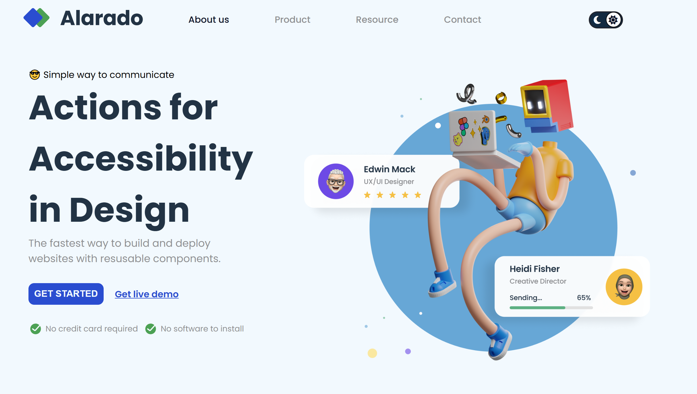

# Página de Inicio Sencilla

Proyecto de una página de inicio con diseño moderno y tema claro/oscuro.

## Características

- **Diseño Responsivo**: Adaptación para pantallas de diferentes tamaños (PC, tableta, smartphone).
- **Tema Claro/Oscuro**: Botón de alternancia entre modo claro y oscuro.
- **Menú de Navegación**: Navegación principal con efecto de menú hamburguesa.
- **Uso de Google Fonts**: Fuentes modernas para una mejor apariencia tipográfica.

## Tecnologías Utilizadas

- **HTML**: Para la estructura de la página.
- **CSS**: Para el estilo y diseño visual del sitio.
- **Font Awesome**: Para los íconos de sol, luna y menú hamburguesa.
- **Google Fonts**: Para las fuentes tipográficas.

## Vista Previa del Proyecto



## Cómo Ejecutarlo Localmente

1. Clona el repositorio:
    ```bash
    git clone https://github.com/tu-usuario/nombre-del-repositorio.git
    ```
2. Navega a la carpeta del proyecto:
    ```bash
    cd nombre-del-repositorio
    ```
3. Abre el archivo `index.html` en tu navegador.

## Estructura del Proyecto

```bash
/
├── index.html
├── style.css
├── script.js
├── img/
│   ├── alarado-icon-homepage.svg
│   ├── alarado-icon-homepage-dark.svg
│   ├── hero-image-simple-homepage.png
│   ├── Done_ring_round_fill.svg
│   └── vista.png
└── README.md
